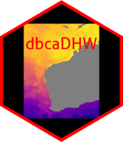

<!-- README.md is generated from README.Rmd. Please edit that file -->

# dbcaDHW 

<!-- badges: start -->

[](https://www.repostatus.org/#unsupported)
[](https://www.tidyverse.org/lifecycle/#stable)
[](https://github.com/dbca-wa/dbcaDHW/issues/)
[](https://github.com/dbca-wa/dbcaDHW/commits/master)
[](https://ci.appveyor.com/project/dbca-wa/dbcaDHW)
[](https://github.com/dbca-wa/dbcaDHW/)
[](https://zenodo.org/badge/latestdoi/276774721)
<!-- badges: end -->

The goal of `dbcaDHW` is to provide tools to prepare downloaded nc
format sea surface temperature (SST) data for further analysis.
`dbcaDHW` has been specifically designed to work with data downloaded
from NOAA’s Coral Reef Watch
[website](https://coralreefwatch.noaa.gov/product/5km/). The package
provides additional vignettes that demonstrate how to create useful SST
metrics including degree heating weeks.

The functions and workflow presented created the various SST metrics
that were used in the Global Change Biology journal
[paper](https://onlinelibrary.wiley.com/doi/abs/10.1111/gcb.15065),
*“Too hot to handle: Unprecedented seagrass death driven by marine
heatwave in a World Heritage Area”*. Please see the paper for details on
how the metrics were used to model the spatial variation in loss of
seagrass in Shark Bay.

## Installation

You can install the development version from
[GitHub](https://github.com/dbca-wa) with:

``` r
# install.packages("devtools")
devtools::install_github("dbca-wa/dbcaDHW")
library(dbcaDHW)
```

## Help Files

All functions within `dbcaDHW` have the usual R help files, however the
best place to see these and the vignettes is the [dbcaDHW
website](https://dbca-wa.github.io/dbcaDHW/index.html)
