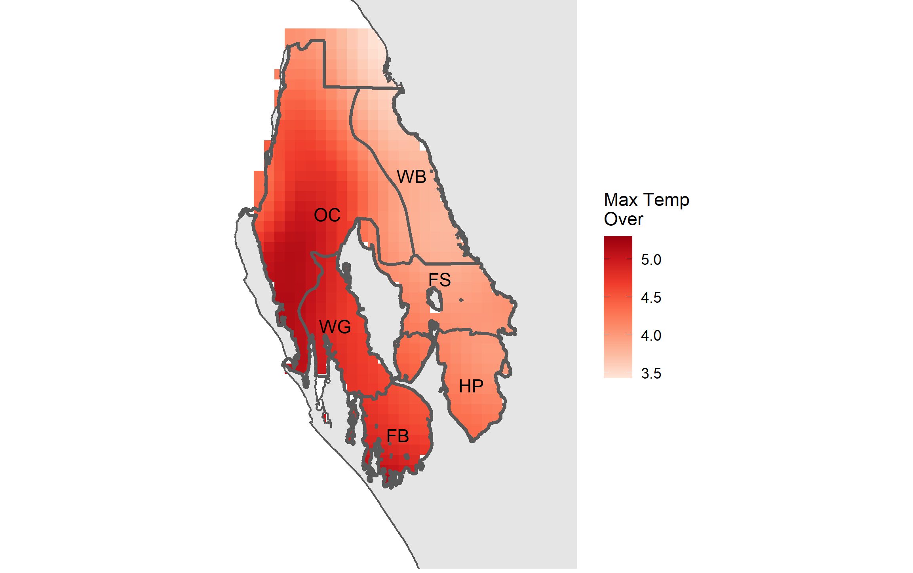

```{r, include = FALSE}
knitr::opts_chunk$set(
  collapse = TRUE,
  comment = "#>"
)
```


# Introduction
The aim of this vignette is to show a method of creating some useful SST metrics from daily data.

By following the vignette **Using dbcaDHW** there will be a csv of SST values and a folder structure that this analysis will utilise. Please read that vignette first if you haven't done so. 

# Raster creation
The metrics created are best stored in rasters to maintain their spatial relationship and can always be re-extracted depending on the need. In raster format they are also in a handy format for visualisation.

First up load up other required packages, read in the previously created data and set up a few useful objects.
```{r, eval=FALSE}
library(tidyverse)
library(lubridate)
library(raster)
library(rgdal)

## read in extracted daily values
dataset <- read_csv("CRW3_1_extract_yourstartdate_yourfinishdate_SST_data.csv")

## sites
sites <- names(dataset)[-1]
g_num <- length(sites) + 1
```

Next up transform into a long format, create some new variables and remove leap days. This analysis will be based on 365 days in a year so we don't need the complexity of including the 29th of February when it rolls around. Also set up a data frame to house all the results prior to writing rasters.
```{r, eval=FALSE}
## wide to long and remove leap days
ndata <- dataset %>%
  tidyr::gather("site", "temp", 2:all_of(g_num)) %>%
  dplyr::mutate(year = substr(dates, 1, 4),
                month = substr(dates, 6, 7),
                day = substr(dates, 9, 10)) %>%
  dplyr::filter(month != "02" | day != "29")

## set up output data frame
outdf <- tibble::tibble(Id = sites, 
                    hot_mean = 0,
                    num_over = 0, 
                    mtemp_over = 0, 
                    strks_over = 0,
                    lstrk_over = 0,
                    max = 0,
                    stringsAsFactors = FALSE)
```

Right, with the setup complete, loop over each site (which is a pixel through time) and define a **past** and **present** period. The user will have to input appropriate dates in the filter arguments below. The dates below are those used in the paper. 

There is a neat gotcha below. Pay attention to the creation of the **nday** variable. We need to number all the days of each year consecutively in order to create a grouping variable so that we can compare all 1st of Januarys to each other etc. So if your data set starts on the 1st of January then its OK to start numbering from 1. However as can be seen in the creation of the **present** data set in which the period starts on the 1st of August, the numbering needed to start at 213. This all depends on what data the user has to analyse and what they define as a **present** starting date. Please choose appropriately.

In the **past** data set, also create an average temperature (e.g. average temperature for all 1st of Januarys etc). A number of metrics are then created and stored in the output data frame:

* hottest mean - **past** period.
* number over - total number of days in **present** period over the hottest mean temperature.
* max temperature over - degrees difference between maximum temperature in **present** period and hottest mean.
* streaks over - number of times the **present** period temperature exceeded the hottest mean for at least 5 consecutive days. If 5 days is not appropriate , change in the code below.
* longest streak - length in days of the longest streak of temperatures in **present** period over the hottest mean for at least 5 consecutive days. If 5 days is not appropriate , change in the code below.
*  max temperature - the hottest temperature in the **present** period.

```{r, eval=FALSE}
for(i in seq_along(sites)){
  cat(paste0("Processing ", sites[i], "...\n"))
  ## define past period - UPDATE WHEN NEW DATA
  past <- ndata %>%
    dplyr::filter(dates < "2010-08-01") %>%
    dplyr::filter(site == sites[i]) %>%
    dplyr::mutate(nday = rep(1:365, length.out = length(day))) %>% #gotta match first start date
    dplyr::group_by(nday) %>%
    dplyr::mutate(avg = mean(temp)) %>%
    dplyr::ungroup()
  
  ## define present period
  present <- ndata %>%
    dplyr::filter(dates >= "2010-08-01" & dates <= "2011-07-31") %>%
    dplyr::filter(site == sites[i]) %>%
    dplyr::mutate(nday = c(213:365, 1:212)) #gotta match first start date
  
  ## hottest mean
  hot_mean <- max(past$avg)
  
  # present temps indicating which higher than threshold
  presenthighs <- present %>%
    dplyr::mutate(overthresh = ifelse(temp > hot_mean, "Y", "N"))
  
  ## rle
  streak <- rle(presenthighs$overthresh)
  
  ## number and lengths of streaks - CHANGE IF 5 DAYS NOT APPROPRIATE
  streakdf <- data.frame(sval = streak[[2]],
                         slgth = streak[[1]],
                         stringsAsFactors = FALSE) %>%
    filter(sval == "Y" & slgth >= 5)
  
  ## number over hottest mean
  num_over <- sum(streakdf$slgth)
  
  ## max temp over hottest mean
  mtemp_over <- max(present$temp) - hot_mean
  
  ## num streaks above hottest mean
  strks_over <- length(streakdf$slgth)
  
  ## longest streak over hottest mean
  lstrk_over <- max(streakdf$slgth)
  
  ## fill output data frame
  outdf[i, 2] <- hot_mean
  outdf[i, 3] <- num_over
  outdf[i, 4] <- mtemp_over
  outdf[i, 5] <- strks_over
  outdf[i, 6] <- lstrk_over
  outdf[i, 7] <- max(present$temp)
}
```

Now its time to write all of these results to rasters. Use one of the existing img files to use as a template (sets up cell resolution, crs etc) and also write all of these results to the extraction shape file.
```{r, eval=FALSE}
## grab example of orig SST img raster to use as template
temp_raster <- raster("./img_data/1985/b5km_sst_v3.1_19850101.img")

## grab extraction shape file to add to
e_pts <- readOGR(dsn = ".", layer = "extraction_pts_3577")

## add new metrics to extraction shape file
e_pts@data <- data.frame(e_pts@data, outdf[match(e_pts@data$Id, outdf$Id),])

## create a folder for output rasters
if(!dir.exists("./sst_metrics")){dir.create("./sst_metrics")}

## write out rasters
rasterize(x = e_pts, y = temp_raster, field = "num_over",
          filename = "./SST_metrics/num_threshold_temp_over_3577.img")

rasterize(x = e_pts, y = temp_raster, field = "mtemp_over",
          filename = "./SST_metrics/max_temp_over_3577.img")

rasterize(x = e_pts, y = temp_raster, field = "strks_over",
          filename = "./SST_metrics/number_strks_over_3577.img")

rasterize(x = e_pts, y = temp_raster, field = "lstrk_over",
          filename = "./SST_metrics/longest_strk_over_3577.img")

rasterize(x = e_pts, y = temp_raster, field = "hot_mean",
          filename = "./SST_metrics/hot_mean_temp_3577.img")

rasterize(x = e_pts, y = temp_raster, field = "max",
          filename = "./SST_metrics/max_temp_3577.img")
```

With the data stored as rasters they can easily be turned into visualisations by adding in some additional vectors representing regions and coastlines etc.


