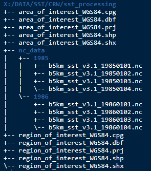
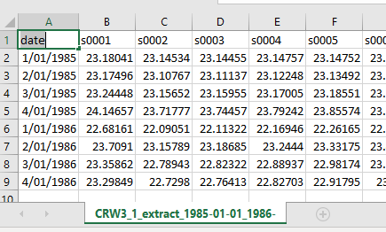
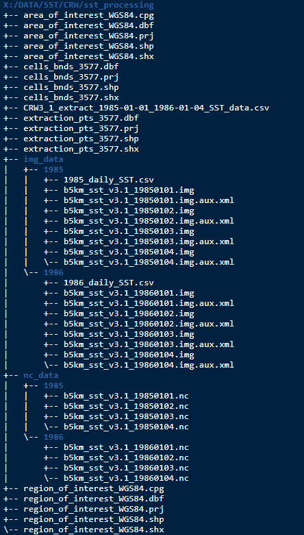

```{r, include = FALSE}
knitr::opts_chunk$set(
  collapse = TRUE,
  comment = "#>"
)
```


# Introduction
The intention behind this package is to share how we went about creating some useful SST 
data that was used in the Global Change Biology journal paper, 
["Too hot to handle: Unprecedented seagrass death driven by marine heatwave in a World Heritage Area"](https://onlinelibrary.wiley.com/doi/abs/10.1111/gcb.15065). The functions 
and workflow suited the particular data and modelling needs presented in the 
paper and as such probably won't be directly transferable to other data sets. 
However it should provide some ideas and all code can be examined in the [package GitHub repo](https://github.com/dbca-wa/dbcaDHW).

Functions used in this package will:

1. convert global SST data sets into more manageable img formatted cropped 
versions (defaults to the Western Australian region).

2. based on a user provided area of interest, create vector shape files based on 
the geometry of the SST data.

3. extract daily SST values and export them to csv file for further analysis.

Lastly, the vignettes **Making metrics**  and **Degree heating weeks** will show how to use the exported data to create useful SST metrics.

# Installation
You can install the development version from [GitHub](https://github.com/dbca-wa) with:
```{r, eval=FALSE}
# install.packages("devtools")
devtools::install_github("dbca-wa/dbcaDHW")
library(dbcaDHW)
```

# Data
The functions were designed to be used on [NOAA's Coral Reef Watch SST data](ftp://ftp.star.nesdis.noaa.gov/pub/sod/mecb/crw/data/5km/v3.1/nc/v0.1/daily/sst/). 
The data is daily sea surface temperatures (SST) in netcdf format (nc).

# Folder Structure
A working directory or R Studio project needs to be determined. The downloaded data and any user supplied shape files should be stored here. Below, a processing file called `sst_processing/` is being used to demonstrate. 

The downloaded data should be stored in a directory called `nc_data/` and within that the data is further organised by year directories. This example shows only the first 4 days of 1985 and 1986. Also present in the working directory is a region of interest (optional) and an area of interest shape file (required) and these will be discussed further.

Any outputs created by the functions will end up in the working directory.




# Workflow

### Step 1
Firstly the downloaded data needs to be saved to img format. This format works well with GIS software and is also easier to handle if cropped to a smaller area. The `nc_to_img` function below defaults to cropping the outputs to a Western Australian region but the user can supply their own if desired. The below example uses the working directory and region of interest as described above.
```{r, eval=FALSE}
# user supplied region of interest
nc_to_img(pathin = "X:/DATA/SST/CRW/sst_processing", vector = "region_of_interest_WGS84")

# default WA region
nc_to_img(pathin = "X:/DATA/SST/CRW/sst_processing")
```

User supplied shape files can have any coordinate reference system as the function will transform to EPSG 3577 (Australian Albers) prior to cropping. When supplying the layer name do not include the suffix. Output img files will be saved in the working directory to a folder called `img_data/` and will be organised by year. They will also have an EPSG of 3577.

### Step 2
The function `create_vectors` will then create 2 new vector files. The user will need to supply an area of interest to further narrow the focus. The output vector files will be created from the geometry of the img raster data. An extraction vector will be created from the centroids of the SST pixels that fall within the area of interest. A cell boundaries vector (based on the pixel boundaries) will also be generated. Whilst not used in any processing here it can be useful to for visualisation.

Both output vector files have an EPSG of 3577 and are also attributed with a common 4 digit site number. Again, the coordinate reference system of the input vector, the area of interest shape file, doesn't matter.
```{r, eval=FALSE}
# user supplied area of interest
create_vectors(pathin = "X:/DATA/SST/CRW/sst_processing", aoi = "area_of_interest_WGS84")
```

### Step 3
The last stage is to use the function `extract_daily` to extract the SST values using the extraction vector that was just made.
```{r, eval=FALSE}
# extract daily SST
extract_daily(pathin = "X:/DATA/SST/CRW/sst_processing")
```

All SST values are then compiled and output to csv file.



The working directory should now look the below. Note there is now a directory tree with img data as well as two new vectors and the csv of SST results.


